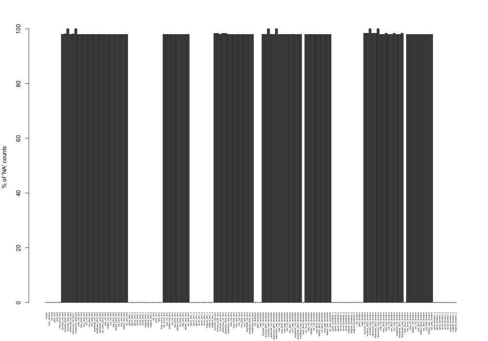

```{r setup, include=FALSE}
knitr::opts_chunk$set(cache=TRUE)
```

<style type="text/css">

body, td {
   font-size: 12px;
}
code.r{
  font-size: 10px;
}
pre {
  font-size: 8px
}
</style>

## The Assignment

Using devices such as Jawbone Up, Nike FuelBand, and Fitbit it is now possible to collect a large amount of data about personal activity relatively inexpensively. These types of devices are part of the quantified self movement – a group of enthusiasts who take measurements about themselves regularly to improve their health, to find patterns in their behavior, or because they are tech geeks. One thing that people regularly do is quantify how much of a particular activity they do, but they rarely quantify how well they do it. In this project, your goal will be to use data from accelerometers on the belt, forearm, arm, and dumbell of 6 participants. They were asked to perform barbell lifts correctly and incorrectly in 5 different ways. More information is available from the website here: [http://groupware.les.inf.puc-rio.br/har](http://groupware.les.inf.puc-rio.br/har).

## The Goal

The goal of this project is to predict the manner in which they did the exercise. The 6 test subjects performed one set of 10 repetitions of the Unilateral Dumbbell Biceps Curl in five different fashions: exactly according to the specification (Class A), throwing the elbows to the front (Class B), lifting the dumbbell only halfway (Class C), lowering the dumbbell only halfway (Class D) and throwing the hips to the front (Class E). This corresponds to  the "classe" variable in the training set. We were allowed to use any of the other variables to predict with. We were requried to create a report describing how we built our model, cross validated, what we think the expected out of sample error is, and why we made the choices you did. Finally, we use our prediction model to predict 20 different test cases. 

## Libraries and Settings

We use the following libraries to perfom our analysis.

```{r}
library(caret)
library(randomForest)
library(gbm)
library(survival)
library(splines)
library(parallel)
library(doParallel)

```

We set the seed to be 
```{r eval=FALSE}
set.seed(222)
```


## The Data

The training and testing data were respectively  downloaded from:

- [https://d396qusza40orc.cloudfront.net/predmachlearn/pml-training.csv](https://d396qusza40orc.cloudfront.net/predmachlearn/pml-training.csv)

- [https://d396qusza40orc.cloudfront.net/predmachlearn/pml-testing.csv](https://d396qusza40orc.cloudfront.net/predmachlearn/pml-testing.csv)

When reading in both datasets we standardise the data by setting any missing values  or `div/0`  to `NA` e.g.

```{r}
data = read.csv("pml-training.csv", na.strings=c("NA","#DIV/0!",""))
```


###  Sample Selection

The training set contains a total of 19622 observations and 160 variables. Not all of these are predictor variables and so we firstly remove columns: `X` (row number), `user_name`, `raw_timestamp_part_1`, `raw_timestamp_part_2` and `cvtd_timestamp`:

```{r}
data <- data[-c(1:6)]
```

Just for conveneince we move the outcome variable `classe` to the first column:
```{r}
data <- data[c(154,1:153)]
```

We found that there are predictor columns with a significant number of missing data. Figure 1 below shows a bar plot of the percentage of NA counts for each variable in the training set:

```{r}
na_count <-100*(sapply(data, function(y) sum(length(which(is.na(y)))))/nrow(data))

```

<figure>

<figcaption style="font-size:10px; margin:0px 0px 20px 0px"> Figure 1.Bar plot showing the percentage of NA counts for each variable in the training set. </figcaption>
</figure>
As we can see all variables with missing data have at least 97.93% without recorded values. That is,  these variables have at most, 406 recorded observations out of a possible 19,622.


```{r}
min(na_count[na_count>0])
```
As such these variables would  have minimal contribution to the training analysis and so we remove these from our analysis:

```{r}
data  <- data[,(na_count==0)]
```

This results in the removal of 100 further variables from our anaylsis giving a total of 53 predictors:

```{r}
names(data)
```  


### Creating Training and Testing Data sets

We can now split the main `data` set into  training and testing samples using  ratio of 60% and 40% respectively:

```{r}
train <- createDataPartition(y=data$classe,p=.60,list=F)
training <- data[train,]
testing  <- data[-train,]
```
This will allow us to perform cross validation and estimate the out-of-samlple error. With this partition we have a total of 11776 observations for the `training` sample and 7846 in the `testing` sample.


### Pre processing with PCA and Cross Validation

#### Principle Component Analysis (PCA)
Since this is quite a high dimensional dataset we explore by how much the predictor variables are correlated.  We do this by applying the `cor` function and isolate variables that have a correlation coefficient > 0.8:

```{r}
corrTrain <- abs(cor(training[,-1]))
diag(corrTrain) <- 0
which(corrTrain>0.8,arr.ind=T)
```


We can see we have a number of  predictors that are highly correlated which would make principal component analysis (PCA) a useful addition to the analysis as it will reduce the number of predictors and help optimise the compuational cost. We will use the `caret` package to perform the training analysis and pass through pre processing options via the `trainControl` function. In terms of PCA we set  `preProcOptions="pca"` which, as default, retains 95% variance. 
This is equivalent to 25 components:

```{r}
 preProcess(training, method = "pca", thresh = 0.95)$numComp
```

#### k-Fold Cross Validation

Implementing k-fold cross-validation will take the training sample and  randomly partition it into k equal sized subsamples. Of the k subsamples, a single subsample is retained as the validation data for testing the model, and the remaining k − 1 subsamples are used as training data. The cross-validation process is then repeated k times (the folds), with each of the k subsamples used exactly once as the validation data. The number of folds one chooses seem to range from 3 to 10. In this analysis we chose n=5.   Finally we can combine the PCA and cross validation options within the  `trainControl` function such that:

```{r}
tr<-trainControl(method="cv", number=5, preProcOptions="pca",savePredictions=TRUE)
```


## Training Analysis


To help speed up the computations we envoke parallel processing prior to making our training model:
```{r}
cl <- makeCluster(detectCores() - 1)
registerDoParallel(cl)
```


### Insample Accuracy

We examine three different appraoches: random forest `rf`, generalised boosted regresssion models `gbm` and support vector machines with radial basis function kernel  `svmRadial`. After training each model we can look at the resulting  `confusionMatrix`  to observe their respective in-sample accuracies.


```{r rf}
# Random forest
rfFit <-train(training$classe ~., method="rf", data=training, trControl=tr, verbose=FALSE)
rfPredTrain=predict(rfFit,training)
confusionMatrix(training$classe,rfPredTrain)$table
rfAccTrain = confusionMatrix(training$classe,rfPredTrain)$overall[[1]]
```


```{r gbm}
# Generalized Boosted Regression Models
gbmFit  <- train(training$classe ~., method="gbm", data=training,trControl=tr,verbose=FALSE)
gbmPredTrain=predict(gbmFit,training)
confusionMatrix(training$classe,gbmPredTrain)$table
gbmAccTrain = confusionMatrix(training$classe,gbmPredTrain)$overall[[1]]
```


```{r svm }
# Support Vector Machines with Radial Basis Function Kernel
svmFit  <- train(training$classe ~., method="svmRadial", data=training,trControl=tr,verbose=FALSE)
svmPredTrain=predict(svmFit,training)
confusionMatrix(training$classe,svmPredTrain)$table
svmAccTrain = confusionMatrix(training$classe,svmPredTrain)$overall[[1]]
```

From the output grids above we can see that the random forest approach performs the best showing a (perhaps unrelasitic) accuracy of unity. The respective in-sample accuracies  are summarised in Table 1 below.


### Out-of-sample accuracy

We can now look at the out-of-sample accuracy by applying the three prediction models to our `testing` (40%) sample:

```{r rfout}
rfPredTest=predict(rfFit,testing)
confusionMatrix(testing$classe,rfPredTest)$table
rfAccTest = confusionMatrix(testing$classe,rfPredTest)$overall[[1]]
```

```{r gbmout}
gbmPredTest=predict(gbmFit,testing)
confusionMatrix(testing$classe,gbmPredTest)$table
gbmAccTest = confusionMatrix(testing$classe,gbmPredTest)$overall[[1]]
```

```{r svmout}
svmPredTest=predict(svmFit,testing)
confusionMatrix(testing$classe,svmPredTest)$table
svmAccTest = confusionMatrix(testing$classe,svmPredTest)$overall[[1]]
```

Comparing the three estimators we find the random forest is the best performer
with  an out of sample error of  `r as.integer((1-rfAccTest)*10000)/100` %. 

#### Table 1
Method | In-sample Accuracy |Out-of-sample Accuracy  |Out-of-sample Error (%)
------------- | ------------- | ------------- | -------------
`rf` | `r rfAccTrain`  |  `r rfAccTest`   |  `r (1-rfAccTest)*100`
`gbm` |  `r gbmAccTrain`  | `r gbmAccTest`  |  `r (1-gbmAccTest)*100`
`svmRadial` | `r svmAccTrain`  | `r svmAccTest`  |  `r (1-svmAccTest)*100`


## Results of Testing on pml-testing Data

After finding the random forest to be the most accurate of the three methods, we apply this to the final
sample of 20 observertions and make predictions to be submittied to Coursera. We apply the same column selection to that the original training data to ensure the fitting model used in the later analysis throw no errors due to missing values:

```{r}
T20 = read.csv("pml-testing.csv", na.strings=c("NA","#DIV/0!",""))
T20 <- T20[-c(1:6)]
T20 <- T20[c(154,1:153)]
T20 <- T20[,(na_count==0)]
```

Now the predicitons:

```{r t20pred}
rfTpred<-predict(rfFit,T20)
predict(rfFit,T20)
```

 To submit the final predictions of the sample of 20, we use the code provided:

```{r writefiles}
pml_write_files = function(x){
  n = length(x)
  for(i in 1:n){
    filename = paste0("problem_id_",i,".txt")
    write.table(x[i],file=filename,quote=FALSE,row.names=FALSE,col.names=FALSE)
  }
}

pml_write_files(rfTpred)
```

We found our results to be 100% correct.


```{r}
stopCluster(cl)
```


## Conclusions

We have built a training model to using data from the Weight Lifting Exercise Dataset, which gathered data from data from accelerometers on the belt, forearm, arm, and dumbell of 6 participants. 

We split the data set into  training (60%) and testing (40%) samples and trained the data on three different machine leanring algorithms, random forest `rf`, generalised boosted regresssion models `gbm` and support vector machines with radial basis function kernel  `svmRadial`. We found the random forest to perform the best and applied this to the final test data of 20 samples and found that it performed well, finding 100% correct classifcation. This is perhaps not too surpriseing since the training model was shown to have ~99.7% accuracy. Since this data is trained to only 6 participants, it possibly is not representative  of a broader range of the population e.g. younger vs older, fitness level etc...  
